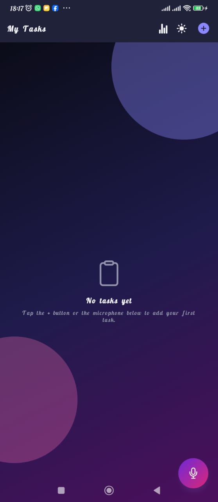
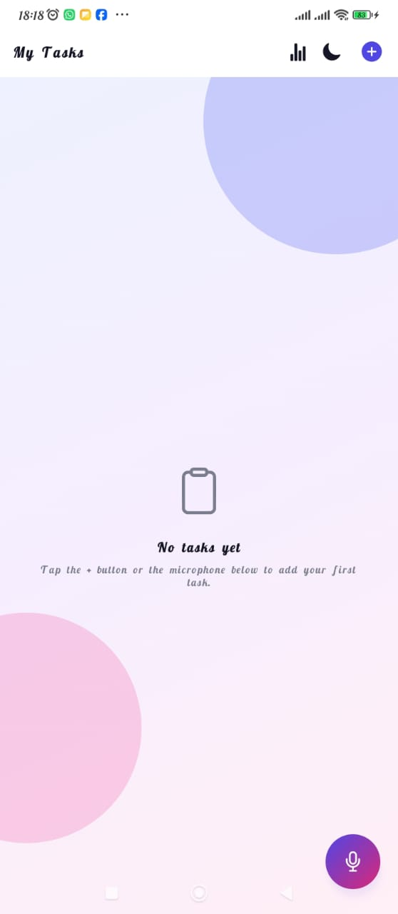
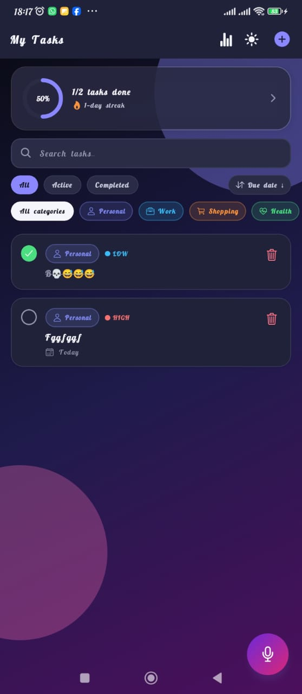

# AAIR To-Do — React Native (TypeScript) Developer Exercise

A polished, animation-rich To-Do List app built with **Expo + React Native +
TypeScript**, built for the AAIR Labs developer exercise. It covers all core
requirements plus every bonus feature, on top of a "Modern Gradient & Glass"
visual redesign: gesture-driven swipe actions, haptic feedback, confetti
celebrations, an animated stats dashboard, priorities, categories, and
checklists.

## Features

### Core
- ✅ Add tasks with a required **title** and optional **description**
- ✅ Mark tasks complete/incomplete (animated checkbox, strikethrough + muted color when done)
- ✅ Delete tasks (with a confirmation prompt, or swipe left)
- ✅ View all tasks in a scrollable list, with completed vs. incomplete visually distinct
- ✅ Persist tasks locally with **AsyncStorage** — survives app restarts
- ✅ **React Navigation** native stack with three screens: `Task List`, `Add/Edit Task`, `Stats`
- ✅ Edge cases handled: empty title validation, empty task list state, empty search-result state
- ✅ **Voice input via FAB**: tap the floating microphone button to dictate one or more
  tasks in natural language (e.g. *"Buy provisions and call mom"*), which are
  automatically split into separate tasks and added to the list.

### Bonus (all implemented)
- 📅 Due dates + sorting (newest/oldest/due date ↑↓/priority/alphabetical) — tap the sort chip to cycle
- 🔍 Search bar + Active/Completed/All filter chips + per-category filter chips
- 🌗 Light/Dark theme toggle (persisted, defaults to the device's system theme), animated sun/moon crossfade
- 🧪 Unit tests (Jest + React Native Testing Library) for the task splitter, date/stats helpers, and the `TaskItem` component
- 🔷 100% TypeScript, strict mode

### Visual redesign & delight (new)
- 🎨 **Modern Gradient & Glass** visual system — gradient backgrounds, frosted-glass (`expo-blur`) hero/stat cards, glowing accent colors, consistent in light and dark
- 👆 **Swipe gestures** (`react-native-gesture-handler`) — swipe a task right to complete it, left to delete it, with a haptic tick the instant the action threshold is crossed
- 📳 **Haptic feedback** (`expo-haptics`) throughout — completing/deleting a task, toggling filters, saving, theme switching
- 🎉 **Celebration moments** — a lightweight, dependency-free confetti burst (built directly on Reanimated shared values) pops on each task completion and again, bigger, the moment every task in the list is done
- 📊 **Animated stats dashboard** — a new `Stats` screen with an animated SVG progress ring, current daily streak, a 7-day completion bar chart, and a per-category breakdown; a compact live version of the ring + streak sits at the top of the task list too
- 🚩 **Priority levels** (None/Low/Medium/High) with color-coded badges and a priority sort mode
- 🏷️ **Categories** (Personal/Work/Shopping/Health/Learning/Other) with icon + color chips, filterable
- ☑️ **Subtasks/checklists** — break a task into smaller steps; the parent row shows a live progress bar
- ✏️ **Edit tasks** — tap any task row to open it for editing (title, description, priority, category, due date, checklist) or delete it
- ✨ Springy, physics-based animations throughout via `react-native-reanimated` — list items fade/slide/reorder with real spring layout transitions, buttons scale on press, the FAB pulses while listening and spins while processing

## Architecture

```
App.tsx                        # Gesture-handler root + providers (Theme, Tasks) + navigation root
src/
  types/Task.ts                 # Shared TypeScript types (Task, Priority, CategoryId, Subtask, nav params)
  constants/
    taskMeta.ts                  # Fixed category/priority metadata (labels, colors, icons)
  theme/
    colors.ts                   # Light/dark color tokens + gradient/glass tokens
    ThemeContext.tsx             # Theme state + persistence (AsyncStorage)
  context/
    TaskContext.tsx              # Global task state, CRUD + subtask actions, AsyncStorage sync
  services/
    storageService.ts            # Thin AsyncStorage wrapper + old-data migration (swap-friendly persistence layer)
    voiceService.ts               # useVoiceInput hook wrapping expo-speech-recognition
  utils/
    taskSplitter.ts               # Splits one dictation into multiple task titles
    dateUtils.ts                  # Due-date formatting / overdue check
    statsUtils.ts                 # Streaks, completion rate, 7-day chart, category breakdown
  navigation/
    RootNavigator.tsx             # Native stack: TaskList <-> AddTask <-> Stats
  screens/
    TaskListScreen.tsx            # Home screen: stats hero, search, filters, sort, category chips, FAB
    AddTaskScreen.tsx             # Add/Edit form: title, description, priority, category, due date, checklist, delete
    StatsScreen.tsx                # Full dashboard: progress ring, streak, 7-day chart, category breakdown
  components/
    TaskItem.tsx                  # Swipeable, animated task row with subtask progress + badges
    SwipeableRow.tsx               # Gesture-driven swipe-to-complete / swipe-to-delete wrapper
    FAB.tsx, EmptyState.tsx, SearchBar.tsx, FilterSortBar.tsx, ThemeToggle.tsx
    CategoryChip.tsx, PriorityBadge.tsx   # Category/priority chips & badges
    ProgressRing.tsx               # Animated SVG circular progress indicator
    ConfettiBurst.tsx              # Dependency-free Reanimated confetti particle burst
    GradientBackground.tsx, GlassCard.tsx  # Shared visual system (gradient wash, frosted-glass surfaces)
    ScalePressable.tsx             # Shared "press to scale + spring back" tactile button wrapper
__tests__/                      # Jest unit/component tests
```

State flows one way: `TaskContext` is the single source of truth for tasks and
persists to `AsyncStorage` on every change; screens/components only read from
and dispatch actions to it via the `useTasks()` hook. `ThemeContext` follows the
same pattern for the light/dark preference. Categories and priorities are a
fixed, curated list (`constants/taskMeta.ts`) rather than user-managed, which
keeps filtering and color-coding simple and predictable.

## Getting Started

### Prerequisites
- Node.js 18+
- Expo CLI (`npx expo`, no global install needed)
- iOS Simulator (Mac + Xcode) and/or Android Emulator (Android Studio), or a
  physical device with the Expo Go / a custom dev client app

### Install

```bash
npm install
```

### Run (text/manual features only, via Expo Go)

```bash
npx expo start
```

Scan the QR code with Expo Go (iOS/Android) or press `i` / `a` for a simulator/emulator.
All core features (add/complete/delete/persist/navigate) work fully in Expo Go.

### Run with voice input enabled (custom dev client required)

`expo-speech-recognition` is a native module and **does not work inside plain
Expo Go**. To use the microphone/FAB feature:

```bash
npx expo prebuild        # generates native ios/ and android/ projects
npx expo run:ios         # or: npx expo run:android
```

This builds and installs a custom dev client with the voice module linked. Grant
microphone + speech-recognition permissions when prompted.

> If you only want to evaluate core CRUD/navigation/persistence, Expo Go is enough —
> tapping the FAB without a dev client will show a friendly explanatory alert
> instead of crashing.

### Run tests

```bash
npm test
```

Covers `taskSplitter` (natural-language task splitting), `dateUtils` (due date
formatting/overdue logic), `statsUtils` (streaks, completion rate, 7-day chart,
category breakdown), and `TaskItem` (rendering + toggle/delete/open interactions).

## How voice input works

1. Tap the FAB (bottom-right mic button). It turns red and pulses while listening.
2. On-device speech recognition (iOS Speech framework / Android `SpeechRecognizer`,
   via `expo-speech-recognition`) transcribes speech to text locally, with **no
   API key required**.
3. The transcript is passed to `splitDictationIntoTasks()` (`src/utils/taskSplitter.ts`),
   which heuristically splits phrases like *"Buy provisions and call mom, then
   water the plants"* on connectors (`and`, `then`, commas, `also`, etc.) into
   separate task titles.
4. Each resulting title is added as its own task via `addTasksBulk`, and a small
   confirmation banner shows what was created.

**Using the OpenAI API instead:** the exercise brief suggests the OpenAI API as
one valid speech-to-text option. The on-device recognizer was chosen as the
default so the app works fully offline with zero configuration/API keys, but
swapping in OpenAI's Whisper API is a small, documented change — see the
comment block at the top of `src/services/voiceService.ts` for the exact
extension point (record audio with `expo-av`, POST to
`https://api.openai.com/v1/audio/transcriptions`, feed the returned text into
the same `onFinalTranscript` callback). No other code needs to change.

## Notes on screenshots
### Home Screen


### Home screen light mode


### Home screen with task



## Evaluation checklist mapping

| Area | Where |
|---|---|
| Code Quality | Modular `src/` structure, typed throughout, comments on non-obvious logic |
| Functionality | `TaskContext` CRUD + subtask actions + edge cases in `AddTaskScreen`/`TaskListScreen` |
| UI/UX | Gradient/glass visual system, swipe gestures, haptics, confetti, `TaskItem`, `EmptyState`, `FAB` |
| React Native Skills | Hooks, Context, React Navigation, `react-native-reanimated`, `react-native-gesture-handler`, `react-native-svg` |
| Persistence | `storageService.ts` (with legacy-data migration) + `TaskContext` AsyncStorage sync |
| Problem Solving | Voice dictation → multi-task splitting (`taskSplitter.ts`); streak/stat derivation (`statsUtils.ts`) |
| Bonus Features | Due dates/sort, search/filter, categories, priorities, subtasks, dark mode, stats dashboard, tests, animations, TypeScript |
